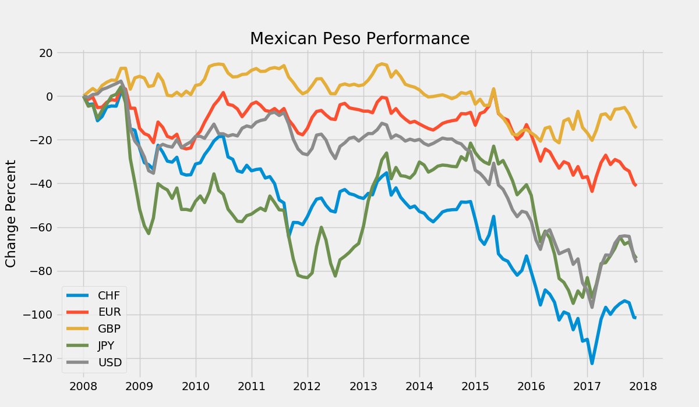
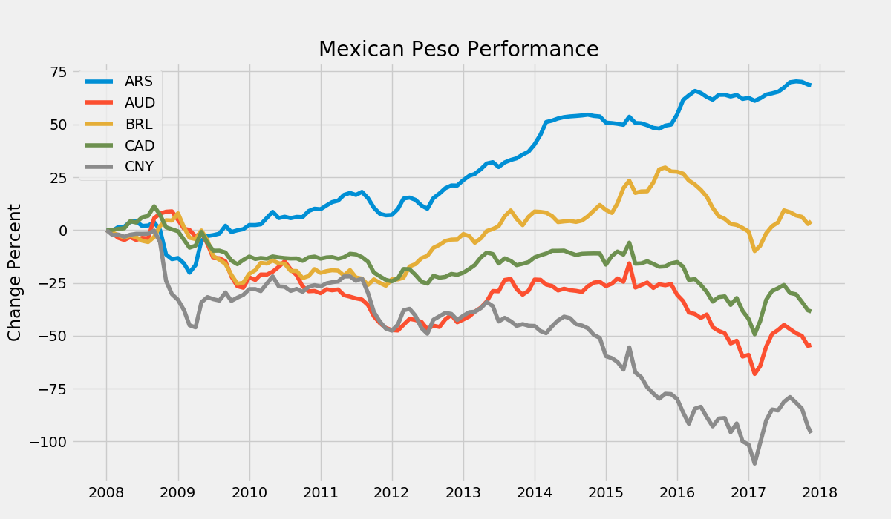

# Mexican Peso Performance in the Last 10 Years

In Mexico it is often a topic of discussion whether the Mexican Peso is devaluating or depreciating. The exchange rate is often used to determine how well is doing the Mexican econonmy.

I took the task on reviewing 10 popular currencies against the Mexican Peso. The objective is to observe how the value of the Mexican Peso has hold in the last 10 years.

To accomplish this I gathered historical data from the last 120 months. Each month was resampled into a single value representing its mean.

The following charts and insights are presented from the Mexican Peso perspective, positive percentage values mean that the Mexican Peso got stronger and negative percent values mean that it got weaker.

The higher the number on the Initial Value, Latest Value, Min, Max and Mean, means the more Mexican Pesos are used to buy other currencies.

The data covers all exchange rates between December 2008 to November 2017.

The insights and charts from this document were generated using the `pandas` and `matplotllb` libraries from the `Python` programming language.

It is important to note that the exchange rate doesn't absolutely represent how a country's economy is performing.

## The Top 5

In the following figure we will observe how the Mexican Peso has performed against the top 5 currencies.

| Code | Name | Initial Value | Latest Value | Percentage Change | Min | Max | Mean |
| ---- |:---------------------|------:|------:|---------:|------:|------:|------:|
| CHF | Swiss Franc          | 10.21 | 18.93 | -0.85% | 9.34 | 21.17 | 14.86 |
| EUR | Euro                 | 16.50 | 22.44 | -0.36% | 15.15 | 23.07 | 18.22 |
| GBP | Great Britain Pound  | 20.77 | 25.76 | -0.24% | 18.67 | 26.60 | 21.90 |
| JPY | Japanese Yen         | 0.10 | 0.17 | -0.69% | 0.09 | 0.19 | 0.15 |
| USD | United States Dollar | 10.48 | 18.21 | -0.74% | 10.10 | 21.35 | 14.46 |

The Mexican Peso lost against all the top 5 currencies. It lost the most against the Swiss Franc, it now costs the double to buy one.

## Popular Currencies

In the next figure we can observe how the Mexican Peso performed against other 5 currencies that are popular.

| Code | Name | Initial Value | Latest Value | Percentage Change | Min | Max | Mean |
| ---- |:---------------------|------:|------:|--------:|-----:|------:|------:|
| ARS  | Argentine Peso       | 3.30 | 0.90 | 0.73% | 0.90 | 4.15 | 2.37 |
| AUD  | Australian Dollar    | 9.85 | 14.06 | -0.43% | 8.63 | 15.91 | 12.40 |
| BRL  | Brazilian Real       | 6.27 | 5.39 | 0.14% | 4.28 | 7.68 | 6.18 |
| CAD  | Canadian Dollar      | 10.34 | 14.34 | -0.39% | 9.60 | 16.16 | 12.69 |
| CNY  | Chinese Yuan         | 1.50 | 2.89 | -0.93% | 1.47 | 3.10 | 2.22 |

The Mexican Peso got stronger against the Argentine Peso (now you know where to vacation).

Similar to the Swiss Franch, the Chinese Yuan costs the double compared to the starting price.

There is something in common in both charts, at the beginning of 2017 the Mexican Peso got significanly weaker against most other currencies.

The following headlines summarize the events of January 2017 that could have affected the value perceived of Mexico.

* Ford announces that it has cancelled plans to build a $1.6 billion plant in Mexico, long criticized by U.S. President-elect Donald Trump, and will invest $700 million in its Michigan plant in Flat Rock, potentially creating 700 new jobs from the investment and expansion of the plant.

* Following a start-of-year hike to the price of gas, widespread riots and looting mostly targeting gas stations, supermarkets and department stores take place in several cities in Mexico. Over 250 people are said to have been arrested so far while blockades to PEMEX installations potentially lead to critical situations in some states. 

* U.S. President Donald Trump issues executive orders to withdraw the United States from the Trans-Pacific Partnership, and reinstates the Mexico City Policy, a policy banning U.S. aid to foreign organizations that use funds from other sources to perform or discuss abortions, which Barack Obama scrapped in 2009.

* Mexican President Enrique Peña Nieto rejects the idea, announced by U.S. President Donald Trump, that Mexico would pay for any border wall between the United States and his country.

* Mexican senior officials say President Peña Nieto may cancel his plans to visit the White House next Tuesday, January 31, because of President Trump's actions.

[Source](https://en.wikipedia.org/wiki/Portal:Current_events/January_2017)

In conclusion, the Mexican Peso has depreciated significantly in the last 7 years but it is also important to note that it has gotten stronger against other currencies which means it only depreciated against the top currencies belonging to countries that are perceived as safer to invest in.